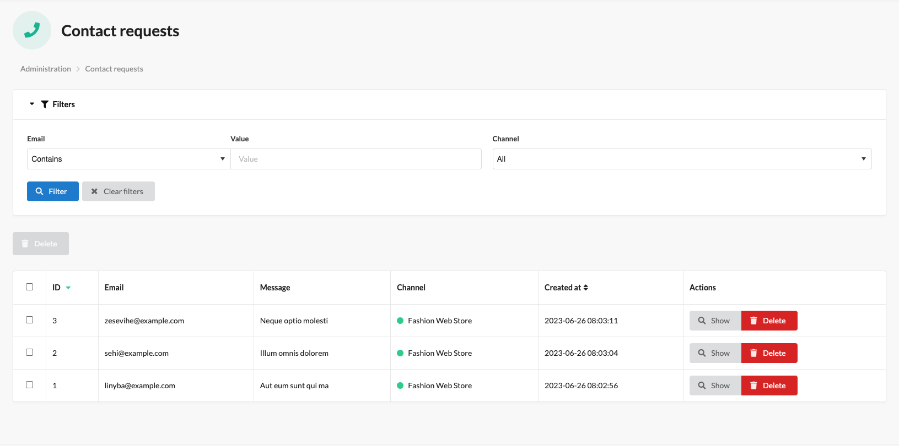
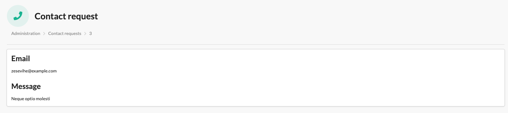

[](https://monsieurbiz.com/agence-web-experte-sylius)

<h1 align="center">Contact Request for Sylius</h1>

[](https://github.com/monsieurbiz/SyliusContactRequestPlugin/blob/master/LICENSE)
[](https://github.com/monsieurbiz/SyliusContactRequestPlugin/actions?query=workflow%3ATests)
[](https://github.com/monsieurbiz/SyliusContactRequestPlugin/actions?query=workflow%3ASecurity)

This plugin saves contact requests made on the native form into the database allowing us to see them in the back-office of Sylius.




## Installation

Install the plugin via composer:

```bash
composer require monsieurbiz/sylius-contact-request-plugin
```

## Getting started

Submit a contact request from the native contact form. Them go in the back-office in the customer menu node you will have a new menu 'contact requests', click on it and 
you can see a grid with the contact requests created.
Obviously, this plugin is not retroactive and contact requests made before the plugin was installed will not be displayed.

### For the installation without flex, follow these additional steps

Change your `config/bundles.php` file to add this line for the plugin declaration:

```php
<?php

return [
    //..
    MonsieurBiz\SyliusContactRequestPlugin\MonsieurBizSyliusContactRequestPlugin::class => ['all' => true],
];
```

Copy the plugin configuration files in your `config` folder:

```bash
cp -Rv vendor/monsieurbiz/sylius-contact-request-plugin/recipes/1.0/config/ config
```

## Contributing

You can find a way to run the plugin without effort in the file [DEVELOPMENT.md](./DEVELOPMENT.md).

Then you can open an issue or a Pull Request if you want! 😘  
Thank you!

## License

This plugin is completely free and released under the [MIT License](https://github.com/monsieurbiz/SyliusContactRequestPlugin/blob/master/LICENSE).
